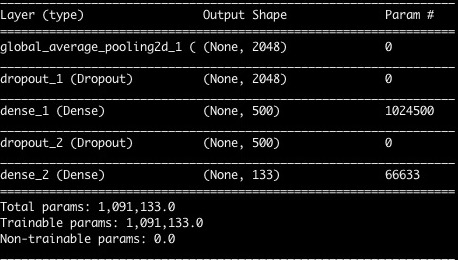

[//]: # (Image References)

[image1]: ./images/sample_dog_output.png "Sample Output"
[image2]: ./images/vgg16_model.png "VGG-16 Model Keras Layers"
[image3]: ./images/vgg16_model_draw.png "VGG16 Model Figure"


## Project Overview

Given an image of a dog, your algorithm will identify an estimate of the canine’s breed.  If supplied an image of a human, the code will identify the resembling dog breed.
To reduce training time without sacrificing accuracy, we will train a CNN using transfer learning. Either VGG-19, ResNet-50, Inception or Xception features

We mention that the task of assigning breed to dogs from images is considered exceptionally challenging.  To see why, consider that *even a human* would have great difficulty in distinguishing between a Brittany and a Welsh Springer Spaniel.

Brittany | Welsh Springer Spaniel
- | -
 | 

It is not difficult to find other dog breed pairs with minimal inter-class variation (for instance, Curly-Coated Retrievers and American Water Spaniels).

Curly-Coated Retriever | American Water Spaniel
- | -
 | 


Likewise, recall that labradors come in yellow, chocolate, and black.  Your vision-based algorithm will have to conquer this high intra-class variation to determine how to classify all of these different shades as the same breed.

Yellow Labrador | Chocolate Labrador | Black Labrador
- | -
 |  | 

We also mention that random chance presents an exceptionally low bar: setting aside the fact that the classes are slightly imabalanced, a random guess will provide a correct answer roughly 1 in 133 times, which corresponds to an accuracy of less than 1%.

Sample Output

![Sample Output][image1]

### Instructions

1. Download the [dog dataset](https://s3-us-west-1.amazonaws.com/udacity-aind/dog-project/dogImages.zip).  Unzip the folder and place it in the repo, at location `path/to/dog-project/dogImages`.
2. Download the [human dataset](http://vis-www.cs.umass.edu/lfw/lfw.tgz).  Unzip the folder and place it in the repo, at location `path/to/dog-project/lfw`.  If you are using a Windows machine, you are encouraged to use [7zip](http://www.7-zip.org/) to extract the folder.
3. Download desired network's pre-computed bottleneck features from
    - [VGG-19](https://s3-us-west-1.amazonaws.com/udacity-aind/dog-project/DogVGG19Data.npz) bottleneck features
    - [ResNet-50](https://s3-us-west-1.amazonaws.com/udacity-aind/dog-project/DogResnet50Data.npz) bottleneck features
    - [Inception](https://s3-us-west-1.amazonaws.com/udacity-aind/dog-project/DogInceptionV3Data.npz) bottleneck features
    - [Xception](https://s3-us-west-1.amazonaws.com/udacity-aind/dog-project/DogXceptionData.npz) bottleneck features

    Place it in the repo, at location path/to/dog-project/bottleneck_features.

4. Install the necessary Python packages.

	For __Mac/OSX__:
	```
		conda env create -f requirements/aind-dog-mac.yml
		source activate aind-dog
		KERAS_BACKEND=tensorflow python -c "from keras import backend"

	For __Windows__:
	```
		conda env create -f requirements/aind-dog-windows.yml
		activate aind-dog
		set KERAS_BACKEND=tensorflow
		python -c "from keras import backend"

### Execution

   * Change the `bottleneck_file` variable to the location of precomputed features file. For InceptionV3, set `bottlenck_file = 'bottleneck_features/DogInceptionV3Data.npz'`
   * Execute the file using `python dog_app.py`


### Model Architecture



### Results

  * The above network was used along with precomputed features values from Inception V3 architecture.
  * Achieved 83.2536% accuracy